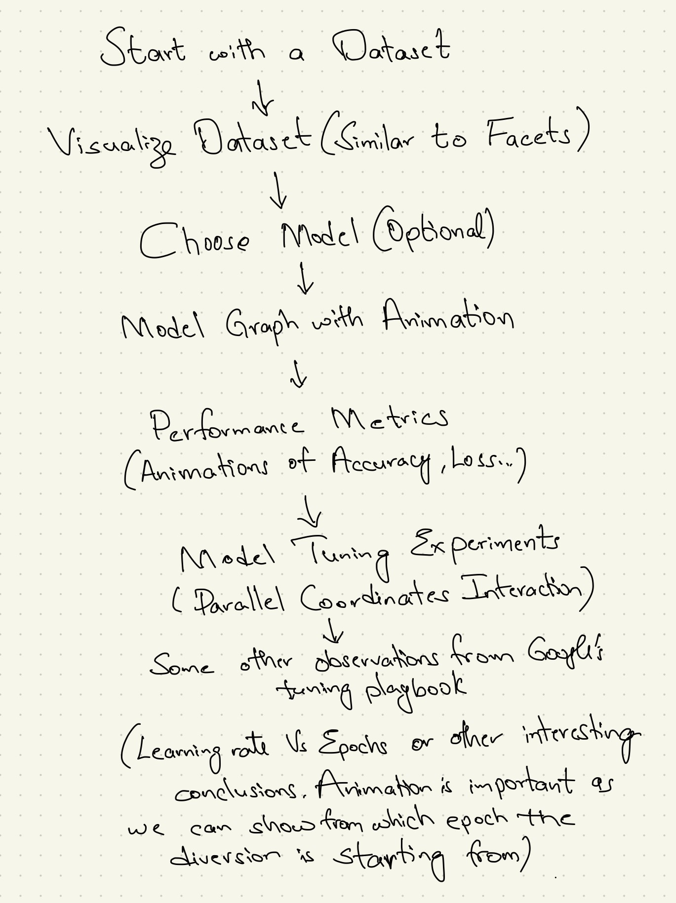

# Tuning-PlaySite
## Team Members
1. Megha Chandra Nandyala
2. Amisha Himanshu Somaiya
3. ShaoJung Kan
4. Wenzheng Zhao
## Motivation
We are a team of four from the Electrical and Computer Engineering department with a shared interest in machine learning. Our goal for this visualization project was to create a useful visualization in the field of machine learning. After bouncing around with a couple of ideas, we initially decided to do *What happens in a ML Model*. Our story board was as follows:

But after discussing with TA Sebastin Santy, we decided to focus on one deliverable instead of trying to cover everything about model building, preferring to provide deep insights rather than a broad overview. So we started to dig deep and we found one aspect of model building which is the most frustrating and often overlooked, **hyper parameter tuning**. 

Hyperparameter tuning can be a frustrating and tedious process, as there is a lot of guesswork involved and multiple runs of the model with different experiments. Furthermore, the process of hyperparameter tuning is rarely documented or explained. All most all papers gloss over the process that led to their final results. Replicating deep learning papers results with the same model is tough due to this black box of tuning steps. To address this challenge, we aimed to draw insights from this process using visualization and provide users with the ability to explore and decide which hyperparameters their model needs.
### Note
We started this with having final project as the final deliverable in mind. For this assignment, we decided to scope in to stick with setting up the basic interaction for further future explorations.
## Data
We couldn't find any dataset available with all the experiments of hyperparameters which was a major hurdle as we need a lot of data to infer insights. So we decided to do these experiments on our own but due to time constraints, we chose only ResNet50 model and trained it on CIFAR-10 dataset which consists 60000 images. 

For the choice of hyperparameters, 
1. The most important one is optimizer. We went with three popular optimizers people generally choose: Adam (perhaps 90% use this), SGD and RMSProp. 
2. For epochs, we chose 1 to 10 with an increment of 1 and later with an increment of 30 upto 150. 
3. Next for the batch size, we chose 16, 32 and 64. We could have gone for 128 but limited machine capabilities. 
4. Later one of the most important yet mostly guessed is learning rate. For this we choose 0.00001, 0.0001, 0.001, 0.01 and 0.1. 

So the total rows of data came upto 765(3\*17\*3\*5). For the performance metrics, we choose Accuracy, Loss and F1-score(to compensate Precision and Recall).
## Interactive Visualization
### Accessing Visualization
Access our visualization [here](https://cse512-23s.github.io/Tuning-PlaySite/) or download the repository and run the HTML page through a server like [LiveServer](https://marketplace.visualstudio.com/items?itemName=ritwickdey.LiveServer).
### Design
--Amisha and Megha
### Development Process
Most of the time from every member was spent on learning D3.js. Below are detailed task delegations.

Megha

Amisha

ShaoJung

 ShaoJung was responsible for integrating the different components of the visualization and ensuring that the final product was cohesive and functional. He worked on determining the best options for utilizing web technologies and connecting them to the parallel coordinates plot. In addition, ShaoJung assisted with the layout design, debugging, and troubleshooting issues that arose during development. ShaoJung also managed the deployment process by adding a script for Github integration.

Wenzheng

 
On homework 3, I was primarily responsible for project ideation, data preparation, data cleaning, and learning D3.js. 
 

