# Tuning-PlaySite
## Team Members
1. Megha Chandra Nandyala
2. Amisha Himanshu Somaiya
3. ShaoJung Kan
4. Wenzheng Zhao

## Motivation
We are a team of four from the Electrical and Computer Engineering department with a shared interest in machine learning. With this project, we aim to create an interactive visualization useful to the ML community. During our brainstorming sessions, we discovered a significant lack of resources for hyperparameter tuning, which can be a frustrating and time-consuming task. It involves randomness and multiple runs of the model to be run under various settings to find the hyper-parameter combinations that give the best performance metrics. Furthermore, the process of hyperparameter tuning is rarely documented or explained. All most all papers gloss over the process that led to their result. Replicating Deep Learning papers results with the same model is tough due to this black box of tuning steps. To address this challenge, we aim to draw insights from this process using visualization and provide users with the ability to explore and decide which hyperparameters their model needs. 
## Data
We couldn't find any dataset available with all the experiments of hyperparameters which was a major hurdle as we need a lot of data to infer insights. So we decided to do these experiments on our own but due to time constraints, we chose only ResNet architecture with varying number of layers trained it on CIFAR-10 dataset which consists 60000 images. We have in total 3300 different iterations which can be found [here](https://github.com/cse512-23s/Tuning-PlaySite/blob/main/src/page-6/Dataset.csv). We did minor modifications to the data in individual pages to fit the narrative.

## Accessing Visualization
-> Access our visualization [here](https://cse512-23s.github.io/Tuning-PlaySite/) or 

-> Download the repository and run the HTML page through a server like [LiveServer](https://marketplace.visualstudio.com/items?itemName=ritwickdey.LiveServer).

## Page 1
This page serves as an introduction, providing essential details such as team member information, a video walkthrough for support, and a comprehensive written document explaining the entire concept. It also offers background context on our motivation and the initial steps taken in developing our tuning strategy.
## Page 2
The decision to dedicate a specific page to the exploration of the relationship between batch size and validation accuracy stems from the realization that this topic is often misunderstood or accompanied by misconceptions. Many practitioners and researchers may have misconceptions regarding the impact of batch size on model performance. By addressing these misconceptions and providing a clear understanding of the relationship, we aim to help users optimize their models and avoid common pitfalls.

The primary objective of this page is to provide a comprehensive analysis of the relationship between batch size and validation accuracy. By visualizing the data and showcasing the trends and patterns, we aim to demonstrate the impact of different batch sizes on model performance. Additionally, we seek to dispel misconceptions and clarify that while increasing batch size can have a linear effect on accuracy, it is crucial to optimize other hyperparameters for individual batch sizes to achieve the best performance. This analysis will help users make informed decisions and optimize their models accordingly. The page is strategically placed as the second page, immediately following the introduction, to capture the readers' attention and provide a smooth transition into the detailed exploration of hyperparameter optimization.

### Design Considerations:
To effectively communicate the insights and facilitate understanding, several design decisions were made.

Firstly, the inclusion of three charts serves to provide a comprehensive analysis. The first chart presents a general overview of the relationship between batch size and validation accuracy, highlighting the linear effect of increasing batch size. However, it also emphasizes the need to consider other hyperparameters for optimal performance.

The second chart aims to demonstrate that the impact of batch size on model performance is highly dependent on other hyperparameters. By optimizing the hyperparameters individually for each batch size, the chart showcases that there is no significant effect of increasing batch size on the model's performance. This insight is crucial in dispelling the misconception that larger batch sizes always lead to better performance.

Lastly, the third chart introduces theoretical expectations and actual performance, shedding light on the complexities of hyperparameter tuning. By comparing these two lines, users can understand that the actual performance may deviate from theoretical expectations, further emphasizing the need for careful hyperparameter optimization.

The decision to use line graphs for visualizing the relationship between batch size and validation accuracy allows for a clear representation of the continuous nature of the relationship. Line graphs effectively showcase trends and patterns over a range of values, enabling users to grasp the impact of batch size on model performance.

In terms of size, each chart was designed to fit within a 500x500-pixel space, ensuring a visually appealing and balanced layout while allowing for easy viewing and interpretation. This size provides enough room to display the data without overwhelming the readers.

Color choices were carefully considered to aid in differentiating between user predictions and actual data. Blue was selected to represent user-drawn elements, symbolizing predictions, while red was chosen to represent actual or reference data. This color scheme enhances the clarity and understanding of the visualization.

Scaling methods were chosen based on the characteristics of the data. The first and second charts utilize a logarithmic scale (base 2) for the X-axis to accommodate a wide range of batch sizes. This scale evenly spreads the data points and enhances visibility, particularly for smaller batch sizes. The Y-axis in both charts employs a linear scale, providing an intuitive representation of the validation accuracy values.

Additionally, the inclusion of interactive elements, such as the ability to draw user predictions and compare them with actual data, enhances user engagement and promotes a deeper understanding of the relationship. This interactivity encourages users to actively participate in the analysis and reinforces the importance of considering other hyperparameters alongside batch size.

The design decisions, including the choice of line graphs, consistent chart sizes, appropriate color selection, scaling methods, and interactive features, were carefully implemented to support the objectives of effective communication and insightful exploration of hyperparameter optimization. This visual analysis allows users to intuitively comprehend the relationship between batch size and validation accuracy, aiding in the decision-making process for optimizing hyperparameters in machine learning models.

## Page 3
### Choice of Chart Type
This page aims to provide the user an informative and interactive view of the effect of different learning rates on the optimizer performance. We consider 3 optimizers : Adam, SGD and RMSprop. We visualize the effect of 5 learning rates on each of these. For the choice of chart type, we experimented with small multiples, group bar chart, and density charts but found a single multi-line plot chart with user-interactions to be the most effective. 

### Choice of Encodings
The goal of this visualization is to provide the user with 2 main interactivities : (1) compare different learning rates for each optimizer (2) compare different optimizers for each learning rate. Thus we choose the following encodings : 
-	X axis : Epochs 
-	Y axis : Validation Loss
-	Mark encoding (solid, dotted, dashed lines) : 3 Optimizers : Adam, RMSProp, SGD
-	Color encoding : 5 learning rates

We chose to encode learning rates with color and optimizers with marks and not vice-versa because if we gave mark encodings to learning rates, there would be 5 different marks (instead of 3 currently) and the user would be required to refer to the legend multiple times to interpret the visualization, which would increase cognitive load for the user. Hence we chose color encodings for learning rates and mark encodings for optimizers.

Choice of Color Scheme 

The color scheme was chosen in consideration to be colorblindness compatible with reference to the following link :

https://davidmathlogic.com/colorblind/#%23D81B60-%231E88E5-%23FFC107-%23004D40

### Design Layout

  

### Default View
The page begins with the default view of all learning rates for Adam optimizer. This default view is chosen because (1) the first view does not remain blank (2) viewing all lines together for all optimizers would clutter the plot and distract the user (3) Adam being the most used optimizer, viewing just this optimizer with all learning rates gives a nice idea that all learning rates do not perform equally for each optimizer. The button for Adam is turned dark gray in the default view indicating that it has been selected. 

Default view : All learning rates for Adam :

  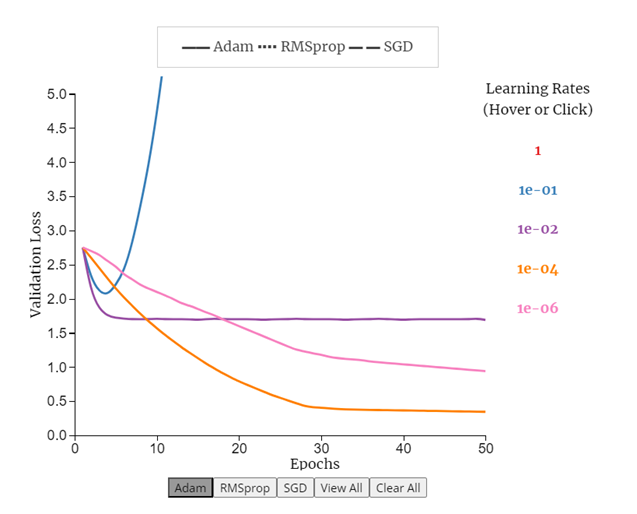

 

### Interactions 
#### Hover Learning Rates to View
This interactive feature enables users to view optimizer performances for each learning rate. By hovering on any learning rate, the 3 optimizer lines for previously selected learning rate disappear and the 3 optimizer lines for the hovered learning rate become visible and stay visible till that learning rate is hovered upon. Once the hover is removed, those lines disappear. For easy interpretability, the learning rates in the interactive legend match the color of line plots for that learning rate. Also, the hovered learning rate becomes bigger in font to indicate current selection. 

For example :  learning rate = 1 :

  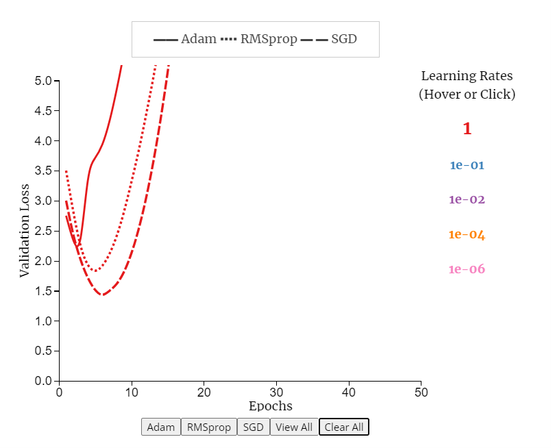

For example :  learning rate = 1e-01 :

  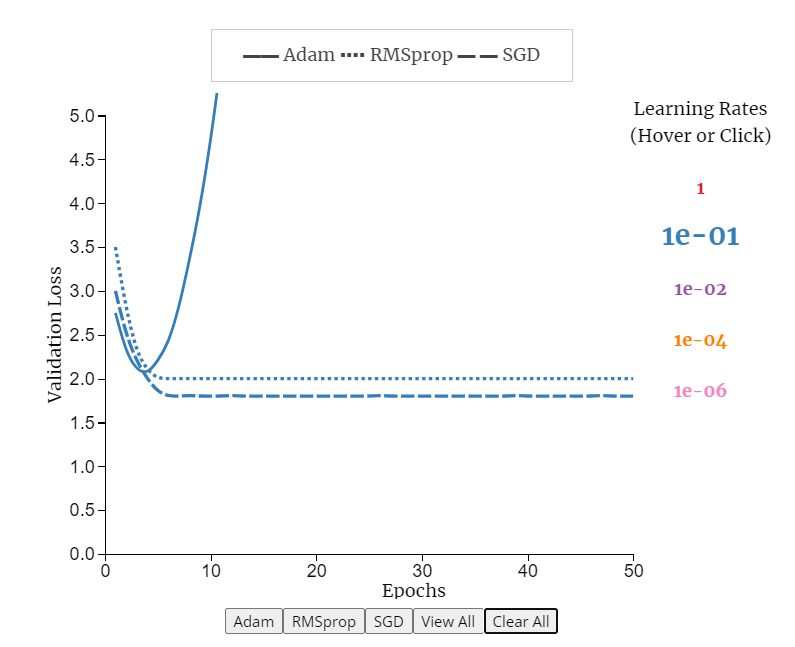

For example :  learning rate = 1e-02:

  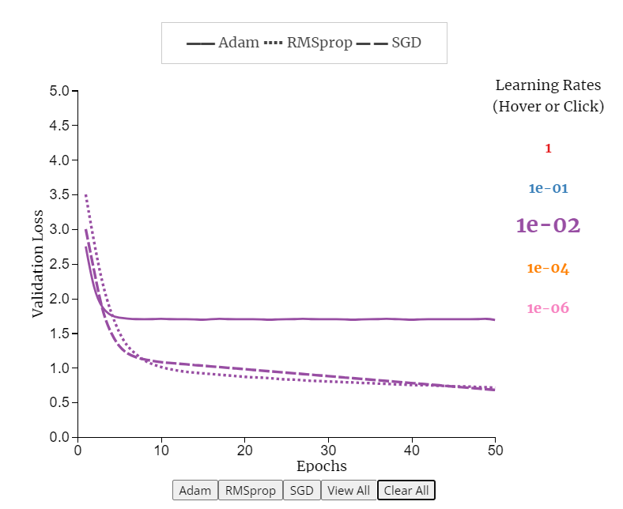

#### Click Learning Rates to Compare
When a user needs to compare several learning rates at once, they can do so by clicking on multiple learning rates. This will select the clicked learning rates to be visible on the chart till clicked again. 

For example :  clicked learning rates of 1e-01 and 1e-04 :

  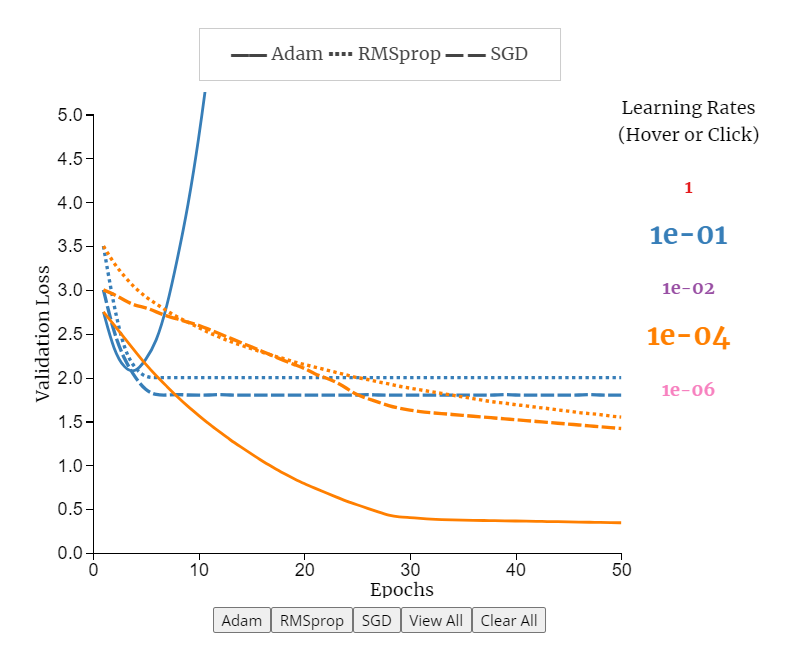

#### View All, Clear All

At any point, if the user needs to view all lines for all learning rates or clear the entire plot, they can do so using these 2 buttons.

Clear All button :

  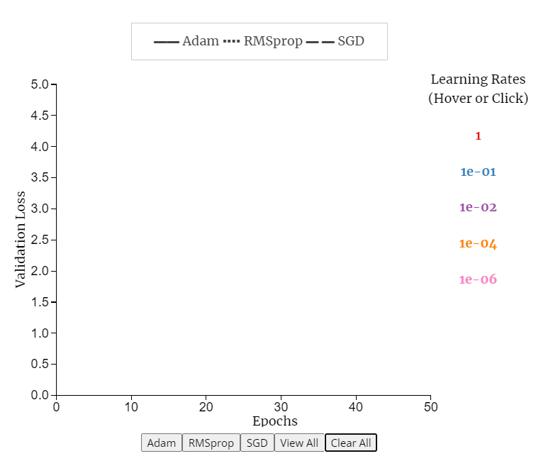

View All button : 

  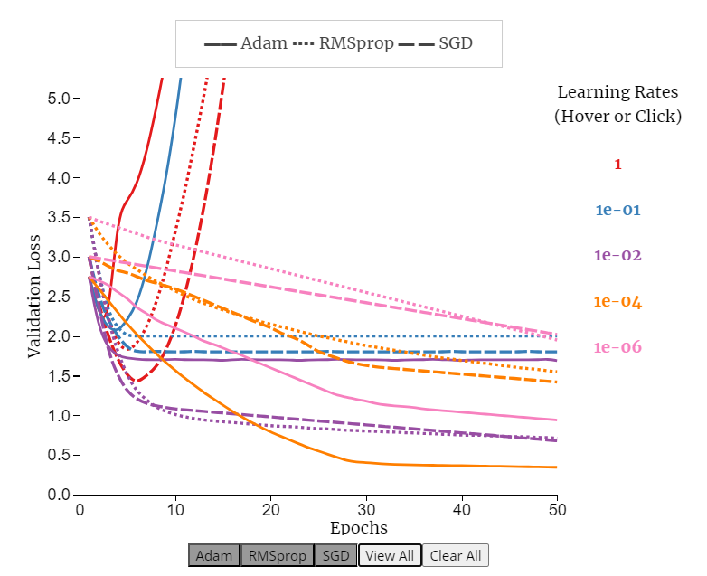

Note that all 3 optimizer buttons turned dark gray to indicate all 3 have been selected for viewing with the View All button. 

#### Adam, RMSProp, SGD buttons

These enable user to view all learning rates for a particular optimizer. Adam was seen in the default view. RMSProp and SGD are as follows, note that the corresponding selected button turns dark gray. 

  

  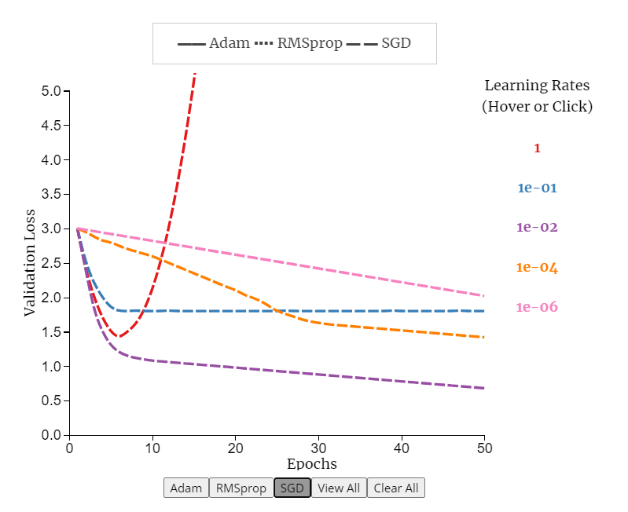

### References 

https://gist.github.com/JessicaFreaner/8fb0ac6c12aa1dab5f70     

https://d3-graph-gallery.com/graph/line_select.html

https://gist.github.com/eesur/6992045bafc8da95b98b

## Page 4
### Choice of Chart Type
This page aims to provide user with 2 informative interactions : (1) fine tuning of individual parameters of an optimizer for example : Adam and (2) performance comparison of optimizers for final optimizer selection and their change in performance at optimal and sub-optimal parameters.  

For the first aforementioned use-case, we experimented with multiple line plot, small multiples, scatter plot, binned histograms etc. We found that 4 integrated subplots controlled with a single slider to be the most effective and expressive, the ‘4-in-1’, as we fondly called it in our team. 

For the second mentioned use case, we experimented with animated multi-line plots and line plots with drop-down menu. We found the chosen surface plot with global and local minima with allowed user interaction anywhere on the contours to be the most effective and expressive. 

#### Design details for 4-in-1
In this plot, we visualize the hyper-parameter tuning for individual parameters of Adam : Beta1 and Beta2 for fixed epochs of 10 and 100.

### Choice of Encodings
-	X axis : log10(learning rate)
-	Y axis : Validation Loss
-	Mark encoding : Line plot
-	Color encoding : single red color to maintain uniformity across all 4 sub-plots
-	Upper 2 sub-plots are for beta1 = 0
-	Lower 2 sub-plots are for beta1 = 0.9
-	Slider interactivity : Beta2 values in steps : (0.99, 0.999, 0.9999)

Blue color for slider and red color for line plot chosen to be compatible with color-blindness with reference to the following link :
https://davidmathlogic.com/colorblind/#%23D81B60-%231E88E5-%23FFC107-%23004D40

The X axis is kept as linear scale of log10(learning rate) instead of log scale to have magnified variations of loss visible for each log values of learning rate. The idea for this x axis scale is taken from the corresponding visualizations in Adam conference paper as cited in references below. Converting this to log scale instead, cramps the values in a smaller space and visualization of loss values at those points becomes illegible hence this scale is retained as linear. 

### Design Layout

  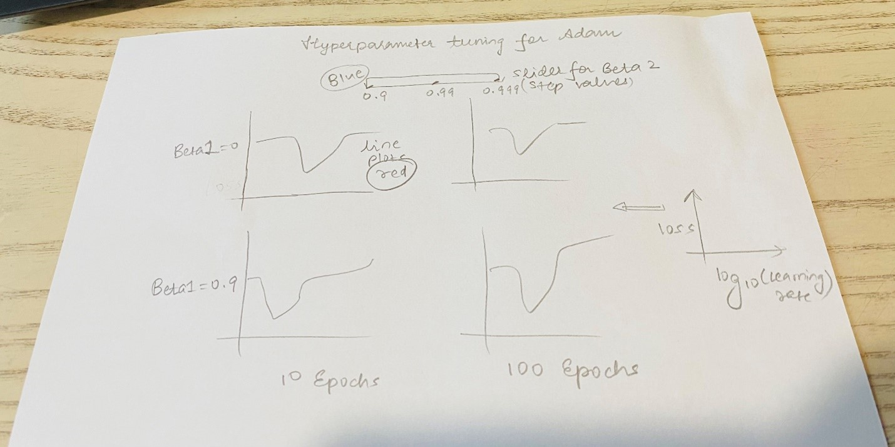

### Default View
The default view is set to beta2 = 0.999 which is the default best value for beta2. i.e. slider position in the middle. So, even if in case user does not perform slider interaction, they will still have an informative visualization of loss values for beta2=0.999 and beta1=0 and 0.9 for epochs 10 and 100. 

  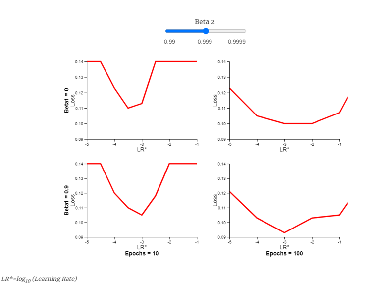

### Interactions 
Slider interaction in 3 steps : 0.99, 0.999, 0.999

For slider position, beta2 = 0.99: 

  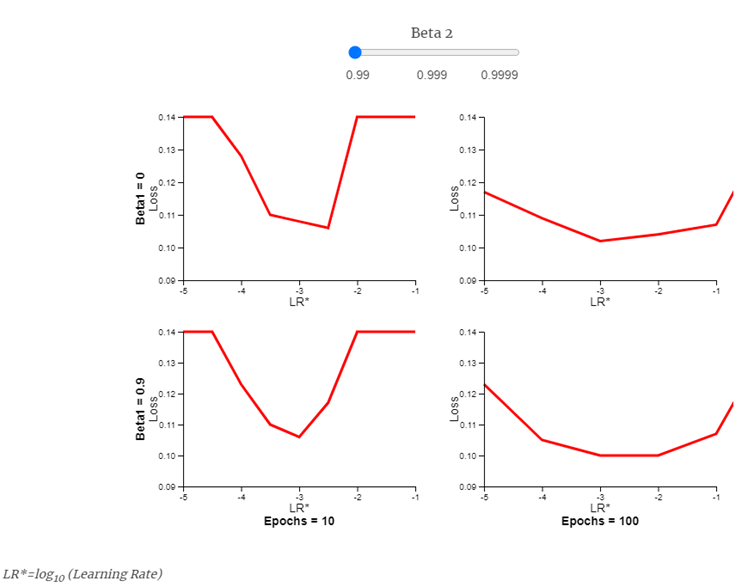

For slider position, beta2 = 0.9999:

  

### Design details for page4-plot2
In this plot, we visualize the performance comparison of all 3 optimizers after tuning each of them for their individual best parameters. This enables selection of optimizer which performs best for the given use-case. Also provided for the user is the interactivity to choose suboptimal parameters to view performance degradation from any given starting point by the user. 

### Choice of Encodings
Color encoding of black-blue-red is chosen for the 3 optimizers in consideration to be colorblindness compatible with reference to the following link : 

https://davidmathlogic.com/colorblind/#%23D81B60-%231E88E5-%23FFC107-%23004D40

### Design Layout

  

### Default View
Since the animation begins when user clicks at any contour point of his choice on the surface plot, the default view is set to the global and local minima. 

### Interactions 
#### Click any starting point on contours of the surface plot
By clicking on any starting point, the visualization depicts the convergence of enabled optimizers from this starting point to global/local minima. The default settings are optimal parameters and all 3 optimizers enabled for viewing. Some examples are shown below:

  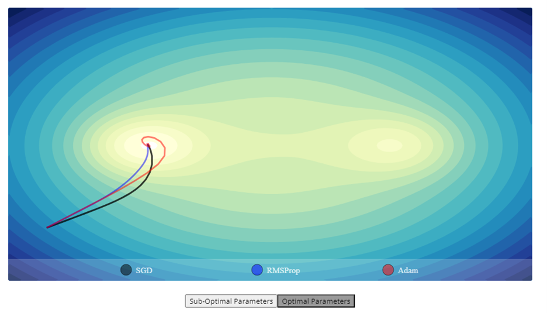

  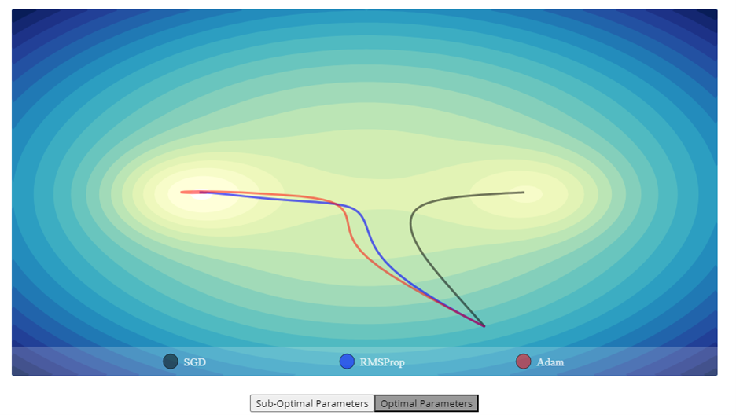

#### SGD, RMSProp, Adam Select to enable viewing
By default, all optimizers are selected for viewing. If needed, user can choose to enable/disable their selection for viewing. 
When disabled, the corresponding round button becomes transluscent.

For example : SGD view disabled : 

  

For example : only Adam view enabled : 

  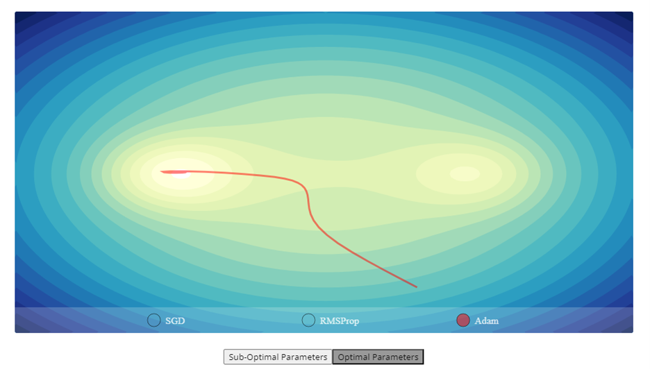

#### Sub-optimal/optimal Parameters buttons
By selecting the corresponding button, the optimizers can be viewed for their sub-optimal or optimal parameters. The corresponding button turns dark gray to indicate selection. By default, optimal parameters are selected. 

For example : Sub-optimal parameters selection:

  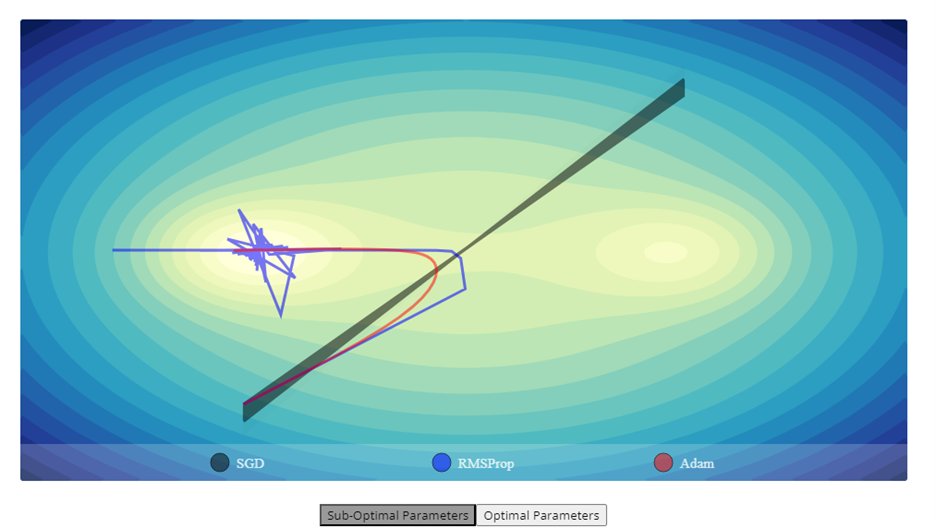

For example : Optimal parameters selection for same starting point:

  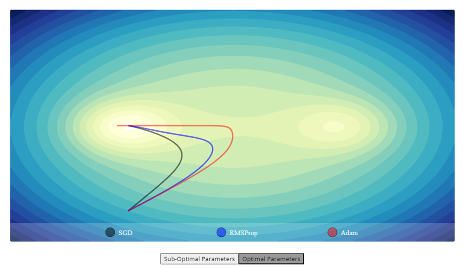

For example : Optimal parameters selection from a different starting point:

  

### References

Adam: A Method for Stochastic Optimization, Diederik P. Kingma, Jimmy Ba, 3rd International Conference for Learning Representations, San Diego, 2015, https://arxiv.org/abs/1412.6980

https://gist.github.com/EmilienDupont/aaf429be5705b219aaaf8d691e27ca87

Flexible numerical optimization with ensmallen, Ryan R. Curtin, Marcus Edel, Rahul Ganesh Prabhu, Suryoday Basak, Zhihao Lou, Conrad Sanderson, https://arxiv.org/abs/2108.12981, 
https://vis.ensmallen.org/

https://www.npmjs.com/package/d3-contour?activeTab=readme

https://gist.github.com/pstuffa/26363646c478b2028d36e7274cedefa6

https://yqnn.github.io/svg-path-editor/

https://www.researchgate.net/figure/Trial-results-of-all-optimizers-in-CIFAR-10-The-parameters-tuned-for-each-optimizer-as_tbl3_360042304

## Page 5
The purpose of this page is to present information about different hyperparameters for tuning convolutional neural networks and their commonly used values. Initially, we compiled a list of all the hyperparameters, which appeared in a hierarchical flow. We attempted to visualize them using tree maps, but the team felt that the aesthetics were not satisfactory. Then, we explored node-link diagrams due to the presence of multiple subcategories within each category. We experimented with a radial tree layout, but it resulted in excessive white spaces due to the limited data available. Eventually, we concluded that sunburst trees would be the ideal choice considering our limited dataset.

### Design
We followed a similar design to the sunburst visualization provided in the d3 gallery. The node width was evenly divided among the categories and subcategories. We added text to each node and ensured that only the text that fit within the node was displayed, avoiding any overlaps between the text. After establishing the basic structure, we focused on interactivity. Clicking on a node would display the entire view of the clicked node as the root, with its subcategories distributed throughout the entire circle. Clicking on the center would revert to the previous root node. We selected a color-blind-safe palette that complements a white background.

Feedback from the milestone review suggested that using a sunburst visualization was unnecessary since every node was clearly visible, making the process of clicking nodes to see subcategories redundant. Therefore, we expanded the visualization by adding more hyperparameters. Importantly, we changed the node width to indicate the importance of tuning the specific hyperparameter mentioned in each node. This approach provides additional information while giving a purpose to node interactivity. We made various minor adjustments, such as modifying the radius, text size, and node width, to ensure that the visualization fits on a single page, eliminating the need for scrolling.
## Page 6

## Development Process
Megha

Megha was responsible for the overall project concept and design flow (total ~40Hrs).
- Storyline (~7 Hrs)
- Proposal (~3 Hrs)
- Batch Size Page Flow (~2 Hrs)
- Page 4 (~8 Hrs)
- Page 3 Modifications (~3 Hrs)
- Page 6 Modifications (~2 Hrs)
- Video Script and slides (~ 4 Hrs)
- Readme for Page 5 (~1 Hr)
- Restructuring Pages and information (~10 Hrs)

Amisha

Amisha was responsible for Page 3, Page 4 and major portions of Page 6 as follows (total ~40 Hrs) :
-	Page layout decisions (~2 Hrs)
-	Visualization design decisions (~4 Hrs)
-	Coding up visualizations in D3.js for pages 3, 4 and 6  (~22 Hrs)
-	Debugging (~2 Hrs)
-	Resolving conflicts between plots to fit into single page (~4 Hrs)
-	Readme for Pages 3, 4 and 6 (~4 Hrs)
-	Video script proof-reading and editing (~2 Hrs)  

James (Shao-Jung) Kan

James (Shao-Jung) Kan was responsible for integrating and publishing the entire project and edit final video (total ~46 Hrs)
- Design Research (~5 Hrs)
- Design Implementation (~25 Hrs)
- Visualization and Integration (~10 Hrs)
- Debugging (~5 Hrs)
- Video Editing (~1 Hr)

Wenzheng

Wenzheng was responsible for Page 2, and project dataset preparation (total ~40 Hrs) :
-	Project Idea Proposal (~3 Hrs)
-	Implementation Method of Interaction Design (~4 Hrs)
-	Page 2 (~8 Hrs)
-	Debugging (~6 Hrs)
-	Page 2 Modifications (~3 Hrs)
-	Dataset Preparation (~10 Hrs)
-	Readme for Pages 2 (~6 Hrs)

